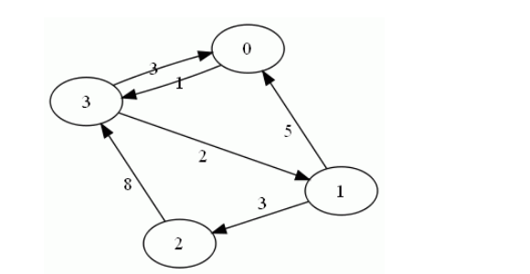

## Shortest Path Implementation

#### Project Description 

This project is regarding the implementation of a shortest path algorithm which finds the shortest path in two vertices in a graph.Even there are so many shortest path algorithms my implementation is based on Dijkstra Algorithm.The program finds shortest path distance to a node which is based on the given node.

# Implementation

#### Directed Graph Implementation 

This is regarding “**MyGraphImplementation.c**” .Its a code which implement a directed graph according to the
given user number of inputs.In this it’s automatically assign numbers as its data upto given number of inputs.
To a better explanation consider following example.



In this weighted directed graph adjacency list representation looks like below.


In here adjacency nodes hold the weight and adjacency list has a pointer to nodes.

This is code to build adjacency node and there is pointer to next node as well.


- [ ] ***struct AdListNode{***
- [ ] ***​	int val;***
- [ ] ***​	int weight;***
- [ ] ***​	struct AdListNode *next;***
- [ ] ***};typedef struct AdListNode LNode;***


In this the data variable holds value we enter as the vertex. According to the above example they are 0,1,2,3.

- [ ] ***struct AdList{***
- [ ] *​	**int data;***
- [ ] ​	***LNode head;***
- [ ] ***};typedef struct AdList adlist;***


***nodesNo*** is the variable which holds value of total number of nodes in graph. Vertices is the name given by me to the adjacency list.

- [ ] ***struct GRAPH{***
- [ ] *​	**int nodesNo;***
- [ ] ​	**adlist *vertices;***
- [ ] ***};typedef struct GRAPH graph;***


This creates graph vertices.Actually it creates Adjacency list to hold its adjacency nodes which connected with it.Here when number nodes entered the ***for loop*** creates vertices with values 1to “***input***” .
​		

```
graph * createGraph(void){
	int input;
	printf("Enter the num of nodes you need : ");
	scanf("%d",&input);
	
	graph *g=(graph*)malloc(sizeof(graph));
	g->nodesNo=input;
	g->vertices=(adlist*)malloc(input * (sizeof(adlist)));

	int i;

	//this will automatically create vertices as 1,2,3,4,.....,input
	for(i=1;i<=input;i++){
		g->vertices[i-1].data=i;
		g->vertices[i-1].head=NULL;
	}

	//this will print verices in the graph
	/*for(i=1;i<=input;i++){
		printf("check graph: %d \n",(g->vertices[i-1].data));
	}*/
	return g;
}
```

This function is to create adjacency nodes.Here it takes a **graph pointer** as an input and allow user to enter values that can connected to given vertex.

Here you can use only the values among **1 *to* *number* of inputs** in the graph which you created before.

```
void buildEdges(graph *g){
	int size=g->nodesNo;

	int i;
	int duplicate=0;//this is to hold the number that given by user(adjacent node value)

	//to terminate from while loop need to give value -1
	printf("If you're done with giving adjacent nodes type -1 to quit \n'");

	for(i=0;i<size;i++){
		printf("\nEnter the out edges of %d",g->vertices[i].data);
		printf("\nEnter the outedge vertice's value :");
		scanf("%d",&duplicate);
	
		while(duplicate!=-1){
			if(duplicate<=size && duplicate>=1){
			
				LNode* newNode = createLNode(duplicate);
				//printf("\ncheck node creation : %d",newNode->val);
			
				newNode->next = g->vertices[i].head;
				g->vertices[i].head = newNode;
				//printf("\nCheck duplicate : %d",g->vertices[i].head->val);
			
				printf("Enter the next value :");
				scanf("%d",&duplicate);
			}else{
			
				printf("Invalid input,Entered value is not a vertice in graph \n");
				printf("Try again!! ,(1 ,2 , 3,..., %d)",size);
				printf("\nEnter the outedge vertice's value :");
				scanf("%d",&duplicate);
			}
		}
	}
}
```

***Prerequisites for Code to work :***

- Need an IDE(Intergarted Development Environment) which supported to C
- In here to implement the graph you should know the exact number of vertices you have.
- The one who execute the program cannot give ***“-1”*** as an adjacency node in this graph implementation because it’s the terminating value of while loop.
- “0”cannot be included in this graph because ***createGraph*** **function** always **generates values from starting 1**

### Dijkstra's Algorithm Implementation

1.First it takes number of nodes as a user input in order to create a graph.The graph will automatically creates nodes starting from 1 up to number of inputs.

2.The function **dijkstra** accept two arguments, a graph and source then output the vertex and its distance from source node.

The following function is to find the index of the node which has currently shortest weight

The if statement checks whether the node is already read or not.

	int miniNode(int dist[], int FNodes[],int size){
		int min=INF,min_node;
		int i;
	
		for(i=0;i<size;i++){
			if(FNodes[i]==0 && dist[i] <=min){
				min =dist[i];
				min_node=i;
			}
		}
		return min_node;
	}

This function prints nodes and the minimum total distance from given source 
	
	void printSPT(int src,int dist[],int size){
		printf("\nVertex distance from given Node :%d \n\n",src);
		printf("Vertex\tDistance\n");
		
		int i;
		for(i=0;i<size;i++){
			if(dist[i]==INF){
				printf("%d\tInfinity :can't reach from given node\n",(i+1));
			}else{
				printf("%d\t%d\n",(i+1),dist[i]);
			}
		}
	}


This is the important function in this implementation.This function performs according to the Dijkstra's algorithm in order to find the shortest path.

	void Dijkstra(graph *g,int src){
		int size,i;
		size=g->nodesNo;
	
		int Distances[size]; //keep track of shortest path distance 
		int FinishedNodes[size]; //keep track of already finished nodes
	
		//initialize the Distance array and FinishedNodes array
		for(i=0;i<size;i++){
			//my graph assign values starting 1 (see the createGraph function)
			if(i==(src-1)){
				Distances[i]=0; //initially only the source node has minimum distance
			}else{
				Distances[i]=INF;
			}
			FinishedNodes[i]=0;//initially there are no finishedNodes
		}
	
		for(i=0;i<size;i++){
		
			int min_node=miniNode(Distances,FinishedNodes,size);
			FinishedNodes[min_node]=1;
		
			int wght,nodeNo;
			LNode *p=g->vertices[min_node].head;
		
			while(p){
			
				wght=p->weight;
				nodeNo=(p->val)-1;//since the graph starts from 1
			
				//only update value if it's not include already
				if(FinishedNodes[nodeNo]==0){
					Distances[nodeNo]=wght+Distances[min_node];
				}
				p=p->next;
			}
		}
	
		printSPT(src,Distances,size);
	}
Since it's hard to analyze the whole code the key aspects of it are mentioned below.

Since this code segment based on Dijkstra's algorithm,

1.Create two arrays which has the same size as number of nodes in given graph

2.The two arrays are to hold Shortest distance and other one is to keep track of nodes which were previously visited.

3.Fill the two arrays with initial values:

​	Distance for nodes are considered as infinite (INF=9999) **except for source node** 

​	At the beginning no nodes have been visited.Hence the flag will be **maintained as 0 initially**. 

4.Until we visited every node we need to repeat following steps:

​	*Find the node with minimum distance

​	*mark that node as **visited (flag=1)**

​	*find its adjacency nodes and its weight.If its not visited update the distance array ***(distance of previous node + weight)**

5.Finally prints the values as described above in **function** ***printPST()***

#### Limitations of Implementing:

1.User need to know number of nodes to build the graph.

2.User cannot input a minus values as number of nodes to implement the graph.

3.Dijkstra function prints only shortest distances from the given node.

