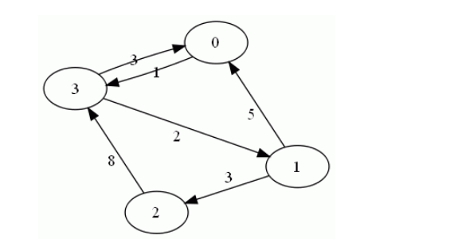
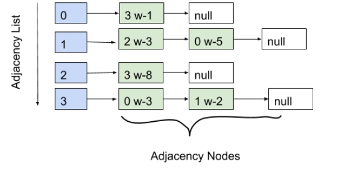
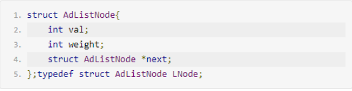
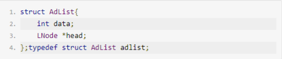
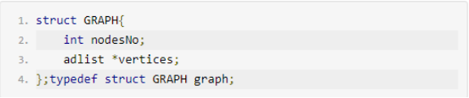
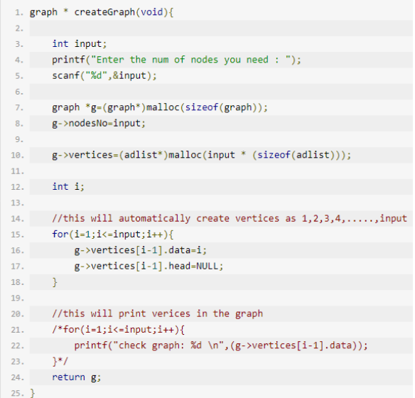
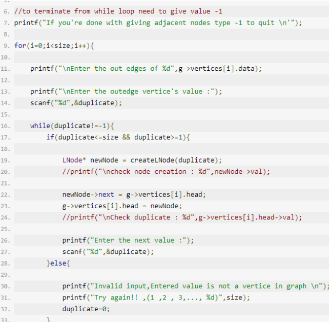

#### Directed Graph Implementation 

This is regarding “**MyGraphImplementation.c**” .Its a code which implement a directed graph according to the
given user number of inputs.In this it’s automatically assign numbers as its data upto given number of inputs.
To a better explanation consider following example.

In this weighted directed graph adjacency list representation looks like below.

In here adjacency nodes hold the weight and adjacency list has a pointer to nodes.

This is code to build adjacency node and there is pointer to next node as well

In this the data variable holds value we enter as the vertex. According to the above example they are 0,1,2,3.

***nodesNo*** is the variable which holds value of total number of nodes in graph. Vertices is the name given by me to the adjacency list.

This creates graph vertices.Actually it creates Adjacency list to hold its adjacency nodes which connected with it.Here when number nodes entered the ***for loop*** creates vertices with values 1to “***input***” .

This function is to create adjacency nodes.Here it takes a **graph pointer** as an input and allow user to enter values that can connected to given vertex.

Here you can use only the values among **1 *to* *number* of inputs** in the graph which you created before.

***Prerequisites for Code to work :***

- In here to implement the graph you should know the exact number of vertices you have.
- The one who execute the program cannot give ***“-1”*** as an adjacency node in this graph implementation because it’s the terminating value of while loop.
- “0”cannot be included in this graph because ***createGraph*** **function** always **generates values from starting 1**